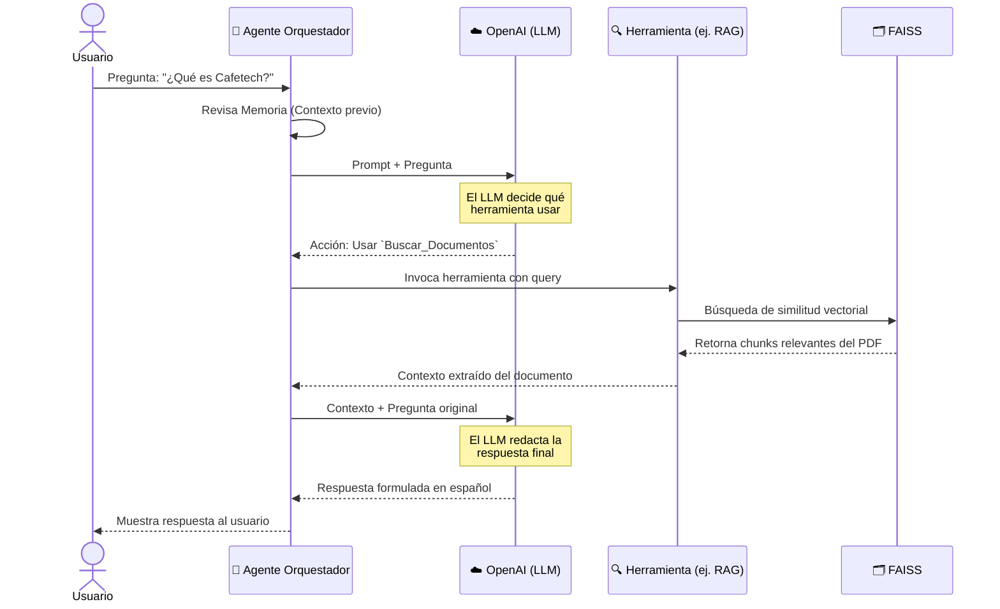

# LangChain RAG Multi-Agente — OpenAI + FAISS + Docker

Proyecto que implementa un sistema **RAG Multi-Agente** usando IA remota (OpenAI API):

| Componente | Tecnología |
|---|---|
| **LLM** | OpenAI GPT-4o-mini |
| **Embeddings** | OpenAI text-embedding-3-small |
| **Framework** | LangChain (Python) |
| **Vector Store** | FAISS (local) |
| **Agentes** | Multi-agente con herramientas (RAG, SQL, K8s) |
| **Memoria** | ConversationBufferMemory |
| **Infraestructura** | Docker Compose |

> 📌 **Versión remota**: Este proyecto usa OpenAI API (nube). Para la versión local con Ollama, ver el [repo langchain](https://github.com/illuminaki/langchain).

## Estructura del proyecto

```
.
├── docker-compose.yml      # Solo contenedor de la app (sin Ollama)
├── Dockerfile              # Imagen Python slim
├── requirements.txt        # Dependencias con langchain-openai + faiss-cpu
├── .env.example            # Variables de entorno (OPENAI_API_KEY)
├── docs/                   # Coloca aquí tus PDFs
├── data/                   # Índice FAISS persistido (auto-generado)
└── app/
    ├── main.py             # Punto de entrada + chat interactivo
    ├── config.py           # Configuración centralizada
    └── rag/
        ├── loader.py       # Carga de PDFs
        ├── splitter.py     # División en chunks
        ├── embeddings.py   # OpenAI Embeddings
        ├── vectorstore.py  # FAISS (crear/cargar)
        ├── chain.py        # Cadena RAG con LCEL
        ├── memory.py       # Memoria conversacional
        ├── tools.py        # Tools: RAG, SQL (mock), K8s (mock)
        └── agents.py       # Agente orquestador multi-herramienta
```

## Inicio rápido

### 1. Clona el repositorio

```bash
git clone git@github.com:Riwi-io-Medellin/langchain-openai.git
cd langchain-openai
```

### 2. Configura tu API Key de OpenAI

```bash
cp .env.example .env
# Edita .env y coloca tu OPENAI_API_KEY real
```

### 3. Agrega un PDF

```bash
cp mi-documento.pdf docs/
```

### 4. Ejecuta y conéctate al chat interactivo

Primero levanta el contenedor en segundo plano:
```bash
docker compose up -d --build
```

Luego **conéctate a la terminal** para poder escribir y chatear con el agente:
```bash
docker attach langchain-openai-rag
```

### O ejecución local (sin Docker)

```bash
# 1. Crear entorno virtual
python -m venv .venv
source .venv/bin/activate

# 2. Instalar dependencias
pip install -r requirements.txt

# 3. Ejecutar
python -m app.main
```

## ¿Cómo funciona?

El sistema se divide en dos fases principales: **Indexación** (preparación de datos) y **Consulta** (interacción multi-agente).

### 1. Arquitectura del Sistema Multi-Agente

```mermaid
graph TD
    classDef user fill:#e1f5fe,stroke:#0288d1,stroke-width:2px,color:#000
    classDef agent fill:#ede7f6,stroke:#673ab7,stroke-width:2px,color:#000
    classDef tool fill:#e8f5e9,stroke:#388e3c,stroke-width:2px,color:#000
    classDef data fill:#fff3e0,stroke:#f57c00,stroke-width:2px,color:#000
    classDef ext fill:#fce4ec,stroke:#c2185b,stroke-width:2px,color:#000

    User((👤 Usuario)):::user

    subgraph LLM & Memoria
        Agent["🤖 Agente Orquestador<br>(LangChain ReAct)"]:::agent
        Mem["🧠 Memoria<br>(ConversationBuffer)"]:::agent
        Agent <--> Mem
    end

    subgraph Cloud API
        OAI["☁️ OpenAI API<br>(GPT-4o-mini)"]:::ext
    end

    subgraph Herramientas (Tools)
        T_RAG["🔍 Herramienta RAG<br>(Buscar en Documentos)"]:::tool
        T_SQL["🗄️ Herramienta SQL<br>(Mock PostgreSQL)"]:::tool
        T_K8S["⎈ Herramienta K8s<br>(Mock Kubernetes)"]:::tool
    end

    subgraph Almacenamiento
        FAISS[("🗂️ FAISS Vector Store<br>(Embeddings locales)")]:::data
        PDFs["📄 Documentos PDF<br>(Directorio docs/)"]:::data
    end

    User -->|1. Pregunta| Agent
    Agent <-->|2. Razonamiento| OAI
    Agent -->|3. Delega tarea| T_RAG
    Agent -->|3. Delega tarea| T_SQL
    Agent -->|3. Delega tarea| T_K8S
    
    PDFs -.->|Indexación previa| FAISS
    T_RAG <-->|Búsqueda Semántica| FAISS
    
    T_RAG -->|4. Contexto| Agent
    T_SQL -->|4. Datos| Agent
    T_K8S -->|4. Estado| Agent
    
    Agent -->|5. Respuesta Final| User
```

### 2. Flujo de una Consulta (Diagrama de Secuencia)



### Herramientas disponibles

| Herramienta | Tipo | Descripción |
|---|---|---|
| **Buscar_Documentos** | Real | Busca en PDFs indexados via FAISS |
| **Consultar_Base_de_Datos** | Mock | Simula consultas SQL a PostgreSQL |
| **Gestionar_Kubernetes** | Mock | Simula operaciones kubectl |

## Configuración

| Variable | Default | Descripción |
|---|---|---|
| `OPENAI_API_KEY` | — | Tu API Key de OpenAI (requerida) |
| `OPENAI_MODEL` | `gpt-4o-mini` | Modelo LLM |
| `OPENAI_EMBED_MODEL` | `text-embedding-3-small` | Modelo de embeddings |
| `DOCS_PATH` | `./docs` | Carpeta de PDFs |
| `FAISS_PATH` | `./data/faiss` | Ruta del índice FAISS |
| `CHUNK_SIZE` | `1000` | Tamaño de cada chunk |
| `CHUNK_OVERLAP` | `200` | Solapamiento entre chunks |

## Diferencias vs. versión local (Ollama)

| Aspecto | Este repo (OpenAI) | Repo local (Ollama) |
|---|---|---|
| LLM | GPT-4o-mini (remoto) | Llama3 (local) |
| Embeddings | text-embedding-3-small | nomic-embed-text |
| Vector Store | FAISS | ChromaDB |
| Agentes | Multi-agente con Tools | Cadena RAG simple |
| Memoria | Sí (ConversationBufferMemory) | No |
| Costo | Pago por uso (API) | Gratuito (local) |
| Requisitos | Solo API Key | GPU/CPU + RAM |

## Licencia

MIT
